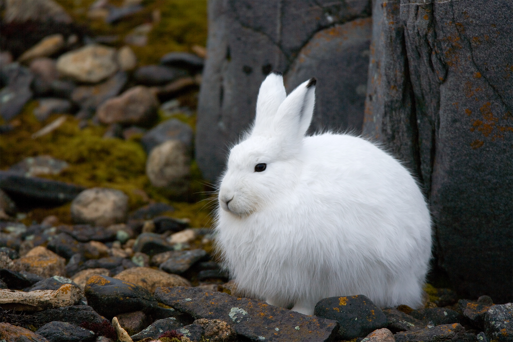

```{r setup, include=FALSE}
knitr::opts_chunk$set(echo = TRUE, 
                      warning = FALSE,
                      message = FALSE)
```

### Task 1. 
 


Prepare a single polished HTML (knitted from .Rmd), planning that this might be a post/project you’d include on your personal blogdown site, that includes at least:

A useful descriptive introductory summary (3 - 4 sentences) of what’s contained in the project





All of your organized and well-annotated code (with warnings/messages hidden) used to create at least:


One finalized graph about the Bonanza Creek snowshoe hare population (you pick which variables, how you want to wrangle it beforehand, and which type of visual to create - but make sure it is beautifully finalized)

One finalized HTML table (probably created using kable & kableExtra) containing summary statistics about the snowshoe hares (again, you pick which variables, and how you want to group/summarize them)

Make sure that both your figure and table appear in your final knitted document, each with a useful caption. Include text associated with each to help the audience understand and interpret the results. 


```{r}

library(tidyverse)
library(kableExtra)
library(janitor)
library(lubridate)
library(tidyr)
library(ggfortify)
library(RColorBrewer)

hares<- read_csv("showshoe_lter.csv") 

hares_mf <- hares %>% 
  mutate(sex = str_to_lower(sex)) %>% # change all entries in sex column to lower case
  filter(sex == "m" | sex == "f") %>% # remove all observations with NA or ? in sex
  mutate(date = mdy(date)) %>% # change date format
  mutate(full_date = date) %>% # retain date column
  separate(date, into = c("year", "month", "day")) %>% #create new columns with parsed date info
  mutate(month = as.numeric(month)) %>% 
  mutate(season = ifelse(month %in% c(1:4, 11, 12), "winter", "summer")) %>% # organize months into "summer" and "winter"
  mutate(year = as.numeric(year))
  
# seems like there are a lot more observations in the summer than in the winter so maybe not an interesting thing to use for visualization

# explore graph
ggplot(data = hares_mf, aes(x = weight, y = hindft))+
  geom_point()+
  facet_wrap(~sex)

# this is not that interesting to me


```

```{r}

# try something else that may be more interesting

hares_hist <- ggplot(data = hares_mf, aes(x = year))+
  geom_bar(aes(fill = sex), position = "dodge")+
  scale_fill_manual(values = c("peru", "peachpuff2"), labels = c("Female", "Male"))+
  scale_x_continuous(expand = c(0,0),
                     breaks = seq(1998, 2012, 1))+
  theme_minimal()+
  labs(x = "Year of Observation",
       y = "Observation Count")+
  theme(legend.title = element_blank())

hares_hist


```
        
**Figure 1. Snowshoe Hare Monitoring Observations in the Bonanza Creek Experimental Forest Between 1998 - 2012.**        
Total number of observations of female and male snowshoe hares are recorded each year during the monitoring period. 
Data source: Kielland K., F. S. Chapin, R. W. Ruess. 2017.


```{r}

# make a summary table for females
hare_summary_f <- hares_mf %>% 
  filter(sex == "f") %>% 
  drop_na(weight, hindft) %>% # take out an values to be able to calculate mean
  group_by(year) %>% # organize by year and sex
  summarize(
    count = length(sex), # number of observations
    avg_weight = round(mean(weight), digits = 0))# mean weight
    
# make a summary table for males
hare_summary_m <- hares_mf %>% 
  filter(sex == "m") %>% 
  drop_na(weight, hindft) %>% # take out an values to be able to calculate mean
  group_by(year) %>% # organize by year and sex
  summarize(
    count = length(sex), # number of observations
    avg_weight = round(mean(weight), digits = 0)) # mean weight

# combine the two tables!
hare_summary <- merge(hare_summary_f, hare_summary_m, by = "year")

# format into a single pretty table
hare_table <- kable(hare_summary, align = "c", col.names = c("Year", "Count", "Average Weight", "Count", "Average Weight"), caption = "Table 1. Sumamry Statistics for Snowshoe Hare Monitoring Observations at Bonanza Creek Experimental Forest Between 1998 - 2012. Annual observation counts and average weight of female and male snowshoe hares are reported for each of the years during the monitoring period") %>% 
  add_header_above(c(" " = 1, "Female" = 2, "Male" = 2)) %>% 
  kable_styling(bootstrap_options = c("striped"), full_width = FALSE)

hare_table

```

Data source: Kielland K., F. S. Chapin, R. W. Ruess. 2017. Snowshoe hare physical data in Bonanza Creek Experimental Forest: 1999-Present. Environmental Data Initiative. https://doi.org/10.6073/pasta/03dce4856d79b91557d8e6ce2cbcdc14. 


### Task 2. 

This dataset, compiled and provided by @zander_venter on Kaggle, is a compilation of data aquired through Google Earth Engine (https://earthengine.google.com/). The dataset uses publically available remote sensing data, where most of the data is derived by calculating the mean for each country at a scale of about 10km. In order to understand the relationship between different environmental and climatic variables included in the dataset, a principal components analysis is provided below to demonstrate directionality of the greatest source of variance within variables considered. These variables were chosen to demonstrate the relationship of variance between different climatic variables included in the dataset. 

Takeaways from the principal components analysis:
 - Elevation and temperature are negatively correlated
 - Isothermality and temperature are positively correlated
 - Mean annual rain, tree cover, and cloudiness are all positively correlated
 - Mean annual rain, tree cover, and cloudiness are not related to elevation or temperature
 - Principal components 1 and 2 explain 75% of variance in the data


```{r, results = FALSE}
# explore data

world_env <- read_csv("world_env_vars.csv") %>% 
  clean_names(case = "upper_camel")

summary(world_env) # check out the dataset


```


```{r, results = FALSE}
# select variables of interest for principal components analysis
env_subset <- world_env %>% 
  select(Elevation, TreeCanopyCover, Isothermality, RainMeanAnnual, TempMeanAnnual, Cloudiness) 

# explore missingness

VIM::matrixplot(env_subset, sortby = "Elevation")
# can't see variable names so not that helpful for exploration

naniar::gg_miss_var(env_subset)
# only a few NAs for each variable, will remove them

env_nona <- env_subset %>% 
  drop_na() # remove NA values


env_pca <- prcomp(env_nona, scale = TRUE) # run PCA

plot(env_pca)
biplot(env_pca) # lookin real UGLY! 


```


```{r}
# a prettier version...
my_pca_plot <- autoplot(env_pca,
                        colour = NA,
                        loadings.colour = "black",
                        loadings.label = TRUE,
                        loadings.label.size = 3,
                        loadings.label.colour = "black",
                        loadings.label.repel = TRUE)+
  theme_bw()

my_pca_plot

```

**Figure 2.** Principal components analysis showing the relationship between variables included in a compilation        
of Google Earth Engine datasets.       
Data source: @zander_venter.